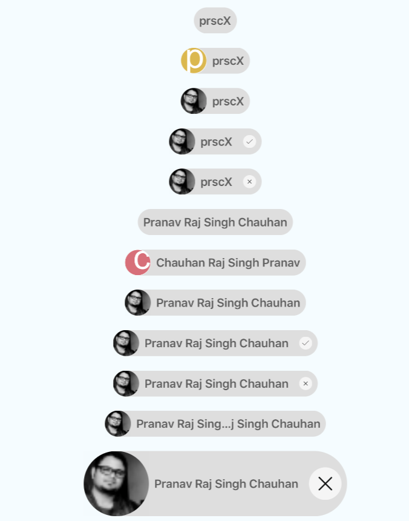

<h1 align="center">

<p align="center">
  
</p>

<p align="center">
  <a href="https://www.npmjs.com/package/react-native-chip-view"></a>
  <a href="https://github.com/prscX/react-native-chip-view/pulls"></a>
  <a href="https://github.com/prscX/react-native-chip-view#License"></a>
</p>


    ReactNative: Material Chip View (Android/iOS)

If this project has helped you out, please support us with a star 🌟
</h1>

Material Chips represent complex entities in small blocks, such as a contact. A chip may contain entities such as a photo, text, rules, an icon, or a contact.


| **Android: [prscX/BottomSheetTextView.Android](https://github.com/prscX/BottomSheetTextView.Android)**             |
| ----------------- |
|                   |


## 📖 Getting started

`$ npm install react-native-chip-view --save`


##### Types of Chips
Chips can be used for various types of entities, including free form text, predefined text, rules, or contacts. Chips may also contain icons.

## 💻 Usage

```javascript

import { RNChipView } from 'react-native-chip-view'

<RNChipView
  title={'prscX'}
  avatar={false}
/>

```


## 💡 Props

| Prop              | Type       | Default | Note                                                                                                       |
| ----------------- | ---------- | ------- | ---------------------------------------------------------------------------------------------------------- |
| `title`       | `string`     |        | Specify label wants to show. **Required**
| `titleStyle`       | `object`     |         | Specify style wants to apply on title
| `titleAllowFontScaling` | `bool`  | `true` |  Title font should scale to respect Text Size accessibility settings
| `onPress`       | `func`     |       | Specify event handler for on press
| `avatar`       | `bool, number, component`     |         | - Specify true in case you need avatar. - Specify avatar in case you want custom avatar
| `avatarStyle`       | `object`     |         | Specify custom avatar style
| `selectable`       | `bool, number, component`     |         | - Specify true in case you need chip as selection. - Specify selection icon in case you want to pass your own icon
| `selectableStyle`       | `string`     |         | Specify custom selectable style
| `cancelable`       | `bool, number, component`     |         | - Specify true in case you need chip as cancelable. - Specify cancelable icon in case you want to pass your own icon
| `cancelableStyle`       | `string`     |         | Specify custom cancelable style
| `backgroundColor`       | `string`     |    `#dedede`    | Specify chip background color
| `maxWidth`       | `string`     |    `300`     | Specify chip max width
| `height`       | `string`     |    `40`     | Specify chip height
| `borderRadius`       | `string`     |    `40`     | Specify container border radius
| `ellipsizeMode`       | `string`     |    `middle`     | Specify text ellipsize mode
| `theme`       | `number`     |    `0`     | Specify avatar icon theme, we have two themes Material: 0 and Flat: 1


## ✨ Credits

## 🤔 How to contribute
Have an idea? Found a bug? Please raise to [ISSUES](https://github.com/prscX/react-native-chip-view/issues).
Contributions are welcome and are greatly appreciated! Every little bit helps, and credit will always be given.

## 💫 Where is this library used?
If you are using this library in one of your projects, add it in this list below. ✨


## 📜 License
This library is provided under the Apache License.

RNChipView @ [prscX](https://github.com/prscX)

## 💖 Support my projects
I open-source almost everything I can, and I try to reply everyone needing help using these projects. Obviously, this takes time. You can integrate and use these projects in your applications for free! You can even change the source code and redistribute (even resell it).

However, if you get some profit from this or just want to encourage me to continue creating stuff, there are few ways you can do it:
* Starring and sharing the projects you like 🚀
* If you're feeling especially charitable, please follow [prscX](https://github.com/prscX) on GitHub.

  <a href="https://www.buymeacoffee.com/prscX" target="_blank"></a>

  Thanks! ❤️
  <br/>
  [prscX.github.io](https://prscx.github.io)
  <br/>
  </ Pranav >